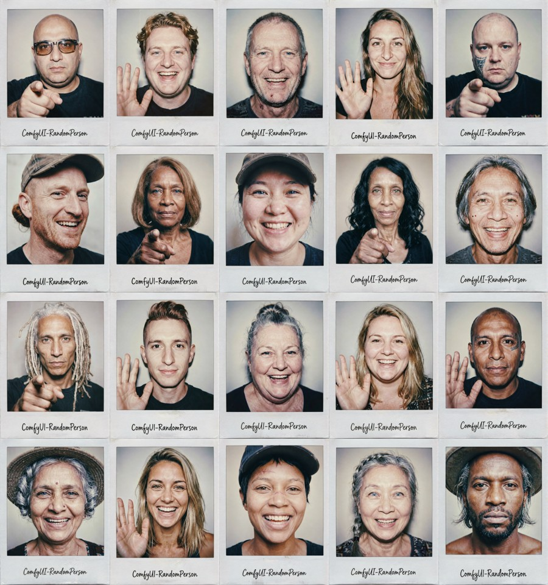
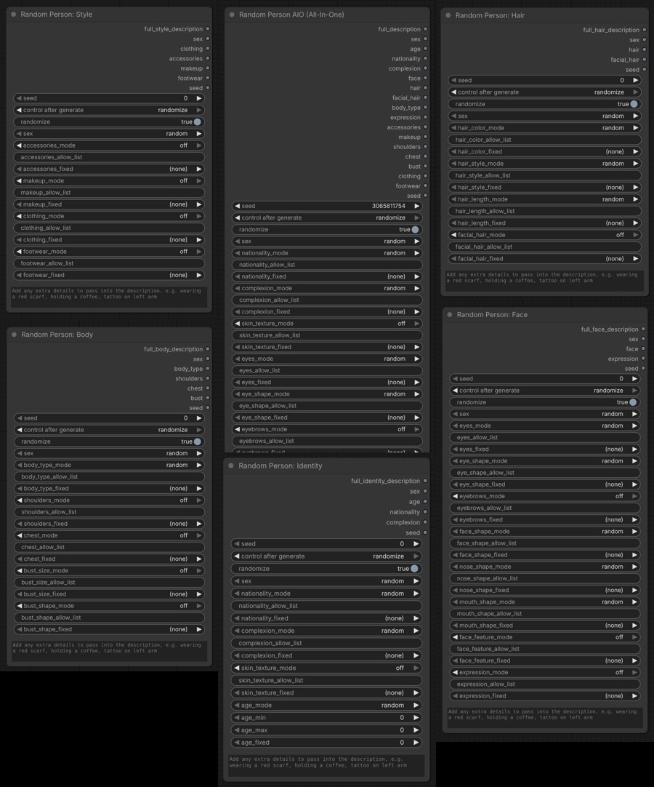

# Random Person Description - Custom nodes for ComfyUI

Generates a randomised, structured physical description of a person to drop straight into an image generation prompt. Every attribute is drawn from curated JSON data files, chosen to keep the output realistic and unambiguous for diffusion models.



## Purpose

When a prompt leaves appearance vague, diffusion models fall back on a narrow set of "default" faces, so every person in a batch looks the same. This node supplies a specific, well-formed description on each run, covering nationality, age, complexion, skin texture, eyes, eyebrows, face, hair, facial hair, build, expression, accessories, makeup, clothing, and footwear. Varying those traits per seed pushes the model off its defaults toward distinct, individual people. Lock the traits you care about, let the rest randomise.

## Nodes

The nodes appear in the **Add Node** menu under **Random Person**:

- **Random Person AIO (All-In-One)** - every attribute on one node (very tall).
- **Random Person: Identity** - sex, age, nationality, complexion, skin texture.
- **Random Person: Face** - face shape, eyes, eyebrows, nose, mouth, distinctive features, expression.
- **Random Person: Hair** - hair colour, style, length, facial hair.
- **Random Person: Body** - build, shoulders, chest, bust size and shape.
- **Random Person: Style** - accessories, makeup, clothing, footwear.



The AIO node exposes every category at once. The segment nodes are independent generators: each has its own seed and sex and emits only its group's fragment. Use one alone, or wire several together (set the same `sex` on each) and concatenate their full description outputs with any string node to assemble a complete prompt.

Each node's first output pin is its full description, named per node: `full_description` (AIO), `full_identity_description`, `full_face_description`, `full_hair_description`, `full_body_description`, `full_style_description`.

**Example output (female):**
```
43 year old Russian female, angular face, light medium complexion, smooth skin, natural grey eyes, button nose, wide-set lips, a faint scar through one eyebrow, red very short hair worn twist out, muscular build, reading glasses, bold lipstick
```

## Installation

### ComfyUI Manager (recommended)

In ComfyUI, open **Manager > Custom Nodes Manager**, search for **ComfyUI_RandomPerson**, click **Install**, then restart ComfyUI.

### Manual install

1. Copy the `ComfyUI_RandomPerson` folder into your `ComfyUI/custom_nodes/` directory.
2. Restart ComfyUI.

## Controls

Each attribute category (nationality, complexion, eyes, hair, body type, etc.) has three controls:

- **mode** - how the value is chosen (see below).
- **allow_list** - comma-separated values to draw from when mode = `allow_list`. Accepts both labels from the data files and custom literal descriptors (e.g. `auburn, fire engine red`).
- **fixed** - a specific value to always use when mode = `fixed`.

### Mode options

| Mode | Behaviour |
|---|---|
| `random` | Pick any value from the full list for the resolved sex |
| `allow_list` | Pick randomly from only the values you specify |
| `fixed` | Always use the value selected in the fixed dropdown |
| `off` | Skip this attribute entirely, it will not appear in the description |

Core identity categories default to `random`. Optional "flair" categories (skin texture, eyebrows, facial feature, facial hair, expression, accessories, makeup, shoulders, chest, bust, clothing, footwear) default to `off`, so the base person stays clean and you opt them in per category.

### Sex

Dropdown: `random` / `male` / `female`. When set, per-category dropdowns filter to sex-appropriate options. Facial hair and makeup are sex-specific: females never grow facial hair, males have no makeup.

### Seed

- `seed` - fixed seed; use the same value to reproduce an identical result.
- `randomize` - when on, ignores the seed and picks a new random person every run.

### Age

`age_mode` (`random` / `fixed` / `off`), `age_min`, `age_max` (0 = no bound, defaults to 90), `age_fixed`. Values below 21 are clamped to 21.

### Extra attributes

A free-text area at the bottom of the node. Comma-separated descriptors are appended to the end of the description exactly as written, e.g. `tattoo on left arm, silver hoop earrings`.

## Output pins

The first pin is the full comma-separated description. Individual pins (`sex`, `age`, `nationality`, `complexion`, `face`, `hair`, `facial_hair`, `body_type`, `shoulders`, `chest`, `bust`, `expression`, `accessories`, `makeup`, `clothing`, `footwear`, `seed`) expose each attribute so you can route specific traits elsewhere in your workflow. Optional attributes are empty when their category is off.

## Data files

All values live in `data/` as plain JSON, split into `shared/`, `male/`, and `female/`. Edit them directly to add, remove, or change any value, no code changes needed. New entries take effect on the next ComfyUI restart.

Each entry follows this structure:
```json
{ "label": "auburn", "description": "auburn" }
```
The `label` appears in dropdowns; the `description` goes into the prompt. They can differ: eye colours use grounded descriptions (`"label": "green", "description": "muted natural green eyes"`), and `clean shaven` / `neutral` / `none` use an empty description so they add nothing.

## Testing

Unit tests cover the selection logic with no ComfyUI install required (they read only the bundled `data/` JSON):

```
cd ComfyUI_RandomPerson
python -m unittest test_random_person -v
```

## Requirements

- ComfyUI (any recent version, Nodes 2.0 compatible)
- Python 3.10+
- No additional pip packages required

The node registers on both the legacy V1 dict API (`NODE_CLASS_MAPPINGS`) and the V3 schema API (`comfy_entrypoint`), so it loads on older and newer ComfyUI builds alike.

## Support

If you find this useful, please consider [starring the repo](https://github.com/bradsec/ComfyUI_RandomPerson). Stars help other people discover these nodes.
