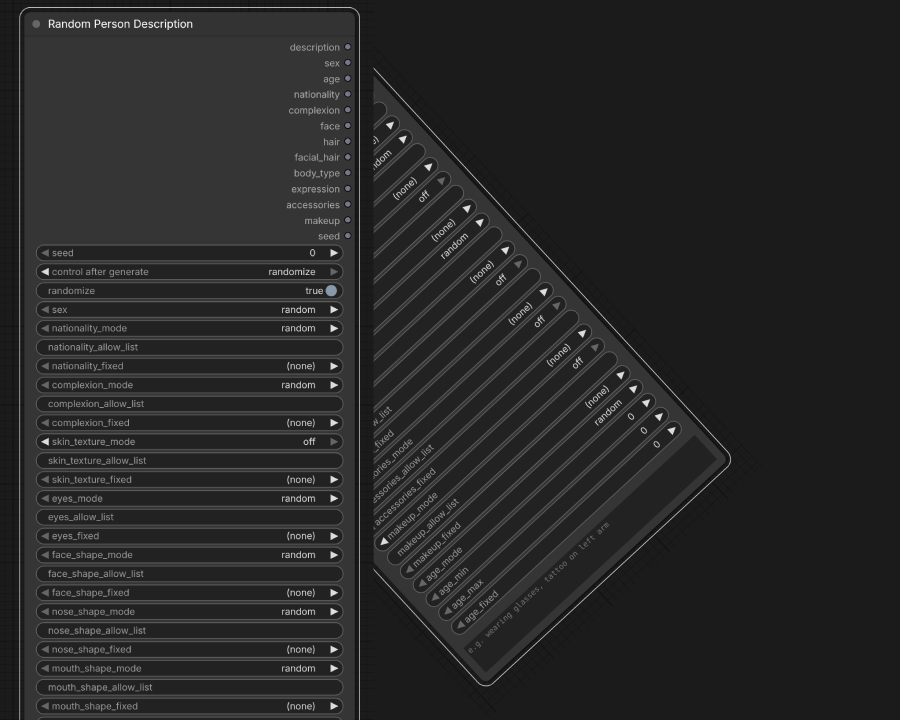

# Random Person Description - Custom node for ComfyUI

Generates a randomised, structured physical description of a person to drop straight into an image generation prompt. Every attribute is drawn from curated JSON data files, chosen to keep the output realistic and unambiguous for diffusion models.



## Purpose

When a prompt leaves appearance vague, diffusion models fall back on a narrow set of "default" faces, so every person in a batch looks the same. This node supplies a specific, well-formed description on each run, covering nationality, age, complexion and skin texture, eye colour and shape, eyebrows, face shape and distinctive features, hair, facial hair, build, shoulders, chest or bust, expression, accessories, makeup, clothing, and footwear. Varying those traits per seed pushes the model off its defaults toward distinct, individual people. Lock the traits you care about, let the rest randomise.

The nodes appear in the **Add Node** menu under **Random Person**:

- **Random Person AIO (All-In-One)** - the full node, every attribute on one node.
- **Random Person: Identity** - sex, age, nationality, complexion, skin texture.
- **Random Person: Face** - face shape, eyes, eyebrows, nose, mouth, distinctive features, expression.
- **Random Person: Hair** - hair colour, style, length, facial hair.
- **Random Person: Body** - build, shoulders, chest, bust size and shape.
- **Random Person: Style** - accessories, makeup, clothing, and footwear.

The AIO node exposes every category at once, so it is a very tall node. You do not have to use it: if you only need part of a person, or want a shorter, tidier graph, use the relevant segment node on its own. The segment nodes are independent generators - each has its own seed and sex and emits only its group's fragment. Use one alone, or wire several together (set the same `sex` on each) and concatenate their full description outputs with any string node to assemble a complete prompt.

Each node's first output pin is its full description, named per node so it is clear where it came from: `full_description` (AIO), `full_identity_description`, `full_face_description`, `full_hair_description`, `full_body_description`, `full_style_description`.

**Example output (male):**
```
74 year old Pakistani male, oval face, light complexion, wrinkled skin, pale light grey eyes,
aquiline nose, wide-set lips, a scar through one eyebrow, ash grey shaved hair worn taper fade, a van dyke beard, athletic build, glasses
```

**Example output (female):**
```
43 year old Russian female, angular face, light medium complexion, smooth skin, natural grey eyes, button nose, wide-set lips, a faint scar through one eyebrow, red very short hair worn twist out, muscular build, reading glasses, bold lipstick
```

## Installation

### ComfyUI Manager (recommended)

In ComfyUI, open **Manager > Custom Nodes Manager**, search for **ComfyUI_RandomPerson**, click **Install**, then restart ComfyUI.

### Manual install

1. Copy the `ComfyUI_RandomPerson` folder into your `ComfyUI/custom_nodes/` directory
2. Restart ComfyUI

The nodes appear in the **Add Node** menu under **Random Person**.

---

## Output Pins

| Pin | Contents | Example |
|---|---|---|
| `full_description` | Full comma-separated description string (the AIO node's first pin; segment nodes name theirs `full_<group>_description`) | `43 year old Russian female, angular face, ...` |
| `sex` | Resolved sex | `female` |
| `age` | Age as a plain number | `43` |
| `nationality` | Nationality descriptor | `Russian` |
| `complexion` | Skin tone and texture | `light medium, smooth skin` |
| `face` | Combined face attributes (shape, eye colour and shape, eyebrows, nose, mouth, distinctive feature) | `angular face, almond natural grey eyes, arched eyebrows, button nose, wide-set lips, a faint scar through one eyebrow` |
| `hair` | Combined hair description | `red very short hair worn twist out` |
| `facial_hair` | Beard / moustache style (empty for clean shaven) | `a van dyke beard` |
| `body_type` | Build | `muscular` |
| `shoulders` | Shoulder descriptor (empty when off) | `broad shoulders` |
| `chest` | Chest descriptor, male (empty when off / female) | `a muscular chest` |
| `bust` | Combined bust size and shape, female (empty when off / male) | `a full, round bust` |
| `expression` | Facial expression (empty for neutral) | `a soft smile` |
| `accessories` | Eyewear / jewellery (empty for none) | `reading glasses` |
| `makeup` | Makeup style (empty for none / male) | `bold lipstick` |
| `clothing` | Garment / outfit (empty when off) | `a leather jacket` |
| `footwear` | Footwear / shoes (empty when off) | `running shoes` |
| `seed` | The seed used (useful for reproducibility) | `481046155` |

Wire `description` directly into a text prompt node, or use individual pins to route specific attributes to other parts of your workflow.

---

## Controls

### Seed & Randomise

| Control | Purpose |
|---|---|
| `seed` | Fixed seed, use the same value to reproduce an identical result |
| `randomize` | When **on**, ignores the seed and picks a new random person every run |

### Sex

Dropdown: `random` / `male` / `female`

When set to `male` or `female`, the dropdown options for hair style, hair colour, hair length, face shape, nose, mouth, body type, facial feature, facial hair, makeup, clothing, footwear, shoulders, chest, bust size, and bust shape automatically filter to show only sex-appropriate options. Facial hair and makeup are effectively sex-specific: females never grow facial hair and males have no makeup options.

### Per-Category Controls

Every attribute category (nationality, complexion, skin texture, eyes, eye shape, eyebrows, face shape, nose shape, mouth shape, facial feature, hair colour, hair style, hair length, facial hair, body type, shoulders, chest, bust size, bust shape, expression, accessories, makeup, clothing, footwear) has three controls:

| Control | What it does |
|---|---|
| **mode** | How the value is chosen, see Mode Options below |
| **allow_list** | Comma-separated list of values to draw from (used when mode = `allow_list`) |
| **fixed** | A specific value to always use (used when mode = `fixed`) |

#### Mode Options

| Mode | Behaviour |
|---|---|
| `random` | Pick any value from the full list for the resolved sex |
| `allow_list` | Pick randomly from only the values you specify in the allow_list field |
| `fixed` | Always use the value selected in the fixed dropdown |
| `off` | **Skip this attribute entirely**, it will not appear in the description |

> **Tip: turning off attributes:** Set any category's mode to `off` to remove it from the output completely. For example, if you don't want a body type in the description, set `body_type_mode` to `off`.

#### Default modes

Core identity categories (nationality, complexion, eyes, eye shape, face shape, nose shape, mouth shape, hair colour/style/length, body type, plus age and sex) default to `random`. The optional "flair" categories default to `off` so the base person stays clean and realistic, and you opt them in per category:

`skin_texture`, `eyebrows`, `face_feature`, `facial_hair`, `expression`, `accessories`, `makeup`, `shoulders`, `chest`, `bust_size`, `bust_shape`, `clothing`, `footwear`

The example outputs above have several of these enabled to show the full range.

#### Allow List: Custom Values

The allow_list field accepts comma-separated values. These can be:

- **Labels from the JSON data**, e.g. `auburn, golden blonde, platinum blonde`, the node will pick randomly from the matched entries
- **Custom values not in any list**, e.g. `fire engine red, pastel pink`, unknown tokens are treated as literal descriptors and added to the pool

This means you can mix standard and custom values freely:
```
auburn, copper red, fire engine red
```

### Age

| Control | Purpose |
|---|---|
| `age_mode` | `random`, `fixed`, or `off` |
| `age_min` | Minimum age (0 = no lower bound). Cannot go below 21. |
| `age_max` | Maximum age (0 = no upper bound, defaults to 90) |
| `age_fixed` | Exact age to use when mode = `fixed`. Values below 21 are clamped to 21. |

### Extra Attributes

A free-text area at the bottom of the node. Enter any custom descriptors separated by commas, they are appended to the end of the description exactly as written.

```
wearing glasses, tattoo on left arm, silver hoop earrings
```

This is the right place for accessories, expressions, poses, or any detail not covered by the built-in categories.

---

## Available Values

### Nationality (65)
Afghan, Algerian, American, Argentinian, Australian, Bangladeshi, Brazilian, British, Cambodian, Canadian, Chilean, Chinese, Colombian, Congolese, Cuban, Dutch, Egyptian, Emirati, Ethiopian, Filipino, Finnish, French, German, Ghanaian, Greek, Indian, Indonesian, Iranian, Iraqi, Irish, Israeli, Italian, Jamaican, Japanese, Kenyan, Korean, Lebanese, Malaysian, Maori, Mexican, Mongolian, Moroccan, Nepali, Nigerian, Norwegian, Pakistani, Peruvian, Polish, Portuguese, Russian, Samoan, Saudi, Somali, South African, Spanish, Sri Lankan, Sudanese, Swedish, Tanzanian, Thai, Turkish, Ugandan, Ukrainian, Venezuelan, Vietnamese

### Complexion (15)
porcelain, fair, light, light medium, warm beige, warm olive, olive, medium, warm medium, tan, golden brown, medium brown, deep brown, deep, ebony

### Skin Texture (19)
smooth, clear, dewy, glowing, matte, oily, large pores, beauty spots, moles, blemished, acne scars, rosacea, vitiligo, ruddy, fine lines, wrinkled, sun-spotted, weathered, leathery

> Skin texture is separate from complexion (tone). It appends after the complexion in both the `description` and the `complexion` pin, e.g. `tan, smooth skin`.

### Eye Colour (23)
brown, dark brown, light brown, near black, hazel, hazel green, hazel brown, amber, blue, light blue, dark blue, ice blue, grey blue, steel blue, green, light green, dark green, olive green, blue green, grey, pale grey, dark grey, grey green

> Eye colour descriptions are deliberately grounded: e.g. `green` outputs as `muted natural green eyes` and `amber` as `warm amber-brown eyes`, to prevent image models rendering oversaturated or unrealistic eye colours.

### Eye Shape (12)
almond, round, hooded, monolid, deep-set, wide-set, close-set, upturned, downturned, heavy-lidded, narrow, large

> Displayed in front of the eye colour in the `face` pin, e.g. `almond hazel eyes`. Defaults to `random`.

### Eyebrows (12)
thick, thin, arched, high arched, straight, bushy, full natural, sparse, well-groomed, rounded, angular, feathered

> Defaults to `off`.

### Hair Colour
**Male (25):** jet black, black, dark brown, chestnut brown, warm brown, brown, medium brown, light brown, auburn, copper red, red, dark red, warm honey, golden blonde, blonde, dark blonde, light blonde, sandy, ash blonde, salt and pepper, silver, ash grey, dark grey, grey, white

**Female (27):** same as male plus strawberry blonde, platinum blonde

### Hair Style
**Male (31):** afro, bowl cut, braids short, bun, buzz cut, caesar cut, coiled natural, cornrows, crew cut, cropped short, curly, curly medium, dreadlocks, faux hawk, french crop, locs long, locs short, low ponytail, messy medium, mohawk, mullet, pompadour, quiff, side part, skin fade, slicked back, straight, taper fade, textured crop, undercut, wavy

**Female (39):** afro, blunt cut, braid over shoulder, braids, bun, chignon, chin length bob, coiled natural, cornrows, cropped short, curly, curtain bangs, dreadlocks, faux hawk, fishtail braid, french braid, half up, high ponytail, jaw length bob, layered, locs, loose curls, loose waves, low ponytail, messy, mohawk, mullet, pixie, pulled back loose, shag, space buns, straight, textured crop, tight curls, twist out, updo, wavy, wispy, wolf cut

### Hair Length
**Male (7):** shaved, very short, short, ear length, medium, shoulder, long

**Female (9):** shaved, very short, short, ear length, chin length, medium, shoulder, long, very long

### Face Shape
**Male (8):** oval, square, rectangular, round, oblong, diamond, triangular, angular

**Female (8):** oval, round, square, heart, diamond, oblong, triangular, angular

### Nose Shape (14 each)
**Male:** straight nose, aquiline nose, broad nose, rounded nose tip, curved nose bridge, snub nose, roman nose, wide nose, flat nose, narrow nose, upturned nose, high nose bridge, low nose bridge, crooked nose

**Female:** straight nose, upturned nose, button nose, broad nose, aquiline nose, snub nose, narrow nose, wide nose, crooked nose, flat nose, roman nose, rounded nose tip, high nose bridge, low nose bridge

### Mouth Shape
**Male (9):** thin lips, full lips, wide mouth, narrow mouth, downturned mouth, upturned mouth, defined cupids bow, prominent lower lip, wide set lips

**Female (12):** same as male plus bow shaped lips, heart shaped lips, rosebud lips

### Facial Feature (distinctive marks)
**Male (13):** heavy brow, scar through eyebrow, deep set eyes, high cheekbones, cleft chin, strong jaw, laugh lines, gap toothed smile, dimples, freckles, mole on cheek, birthmark on jaw, weathered skin

**Female (12):** high cheekbones, scar through eyebrow, deep set eyes, wide eyes, cleft chin, dimples, gap toothed smile, freckles, beauty mark, birthmark, laugh lines, arched brows

> Folded into the `face` pin alongside shape, eyes, nose, and mouth.

### Body Type
**Male (18):** slim, lean, wiry, slight, average, medium build, athletic, muscular, stocky, broad shouldered, tall lean, tall athletic, lanky, heavyset, barrel chested, compact, softly built, dad bod

**Female (19):** slim, lean, wiry, petite, slight, average, medium build, athletic, muscular, tall lean, tall athletic, lanky, pear, hourglass, curvy, full figured, softly built, heavyset, stocky

### Shoulders
**Male (6):** narrow, average, broad, sloping, square, muscular

**Female (6):** narrow, average, broad, sloping, square, soft

> Defaults to `off`.

### Chest (male)
flat, average, broad, muscular, barrel

> Sex-gated: males only. Females have a stub entry so the dropdown is populated but a random female never produces chest text. Defaults to `off`.

### Bust Size (female)
petite, small, average, full, large, extra large

> Sex-gated: females only. Males have a stub entry so a random male never produces bust text. Defaults to `off`.

### Bust Shape (female)
round, teardrop, wide-set, close-set, natural

> Sex-gated: females only. Combined with bust size in the `bust` output pin, e.g. `a full, round bust`. Defaults to `off`.

### Facial Hair (male)
clean shaven, light stubble, heavy stubble, short beard, full beard, goatee, moustache, circle beard, van dyke, mutton chops, soul patch

> Females have only `clean shaven`, so a random female never grows facial hair. `clean shaven` outputs nothing.

### Expression (25)
neutral, soft smile, warm smile, slight smile, gentle smile, serious, stern, pensive, contemplative, confident, relaxed, intense gaze, focused, smirk, raised eyebrow, playful, mischievous, surprised, slight frown, downcast, wistful, weary, brooding, laughing, joyful

> `neutral` outputs nothing, so many people carry no expression text.

### Accessories / Eyewear (25)
none, glasses, thin framed glasses, round glasses, thick framed glasses, reading glasses, sunglasses, aviator sunglasses, stud earrings, hoop earrings, drop earrings, ear cuff, multiple ear piercings, small ear piercings, nose ring, nose stud, septum ring, eyebrow piercing, labret piercing, pendant necklace, choker, headscarf, beanie, cap, bindi

> `none` outputs nothing.

### Makeup (female)
none, natural makeup, soft makeup, minimal makeup, bold makeup, glam makeup, smokey eye, winged eyeliner, red lipstick, bold lipstick

> Males have only `none`. `none` outputs nothing.

### Clothing

**Male (32):** plain t-shirt, fitted t-shirt, button-up shirt, flannel shirt, polo shirt, henley shirt, work shirt, tank top, hoodie, crew-neck sweater, turtleneck, denim jacket, leather jacket, bomber jacket, puffer jacket, parka, trench coat, wool overcoat, blazer, tailored suit, three-piece suit, tracksuit, gym wear, sportswear, streetwear, casual wear, smart casual, business wear, business casual, formal wear, loungewear, beachwear

**Female (34):** plain t-shirt, fitted t-shirt, button-up shirt, blouse, tank top, camisole, off-shoulder top, peplum top, knit sweater, cardigan, hoodie, turtleneck, denim jacket, leather jacket, puffer jacket, trench coat, wool coat, blazer, tailored suit, jumpsuit, sundress, wrap dress, maxi dress, cocktail dress, gym wear, sportswear, streetwear, casual wear, smart casual, business wear, business casual, formal wear, loungewear, beachwear

> Sex-gated. Defaults to `off`.

### Footwear

**Male (28):** ankle boots, bare feet, basketball shoes, boat shoes, brogues, canvas shoes, chelsea boots, combat boots, crocs, derby shoes, dress shoes, espadrilles, flip-flops, formal shoes, high-top sneakers, hiking boots, hiking shoes, loafers, moccasins, oxford shoes, running shoes, sandals, skate shoes, slides, slippers, sneakers, tactical boots, work boots

**Female (38):** ankle boots, ballet flats, bare feet, basketball shoes, boat shoes, brogues, canvas shoes, chelsea boots, combat boots, crocs, derby shoes, dress shoes, espadrilles, flip-flops, formal shoes, high boots, high heels, high-top sneakers, hiking boots, hiking shoes, kitten heels, knee-high boots, loafers, mary janes, moccasins, oxford shoes, platform heels, running shoes, sandals, skate shoes, slides, slippers, sneakers, stilettos, strappy heels, tactical boots, wedges, work boots

> Sex-gated. Heels and flats are female-only; the rest are shared. Defaults to `off`.

---

## Tips

**Reproducing a result**: when you find a description you like, set `randomize` to off and note the seed value from the `seed` output pin. Set `seed` to that value and re-queue to get the same result.

**Locking some attributes, randomising others**: set the attributes you want fixed to `fixed` mode, leave the rest on `random`. For example, fix nationality to `Japanese` and complexion to `warm medium` while letting everything else randomise.

**Building a character type**: use `allow_list` mode with a curated set of values per category to constrain randomness to a character archetype. For example, for a rugged older man: `age_min = 45`, `body_type_allow_list = athletic, broad shouldered, muscular`, `hair_color_allow_list = salt and pepper, silver, grey`.

**Adding detail the node doesn't cover**: use the `extra_attributes` text area for anything else: clothing, accessories, expression, pose hints, scars, tattoos, jewellery, makeup, etc. Each comma-separated entry is appended as its own descriptor.

**Turning off attributes you don't need**: if your workflow already handles body type from another node, or you don't want age in the prompt, set that category's mode to `off`. The attribute disappears from the description entirely.

---

## Data Files

All values live in `data/` as plain JSON files. You can edit them directly to add, remove, or change any value, no code changes needed. New entries take effect on the next ComfyUI restart.

```
data/
├── shared/          # used by both male and female
│   ├── nationality.json
│   ├── complexion.json
│   ├── skin_texture.json
│   ├── eyes.json
│   ├── eye_shape.json
│   ├── eyebrows.json
│   ├── expression.json
│   ├── accessories.json
│   └── age.json
├── male/
│   ├── hair_color.json
│   ├── hair_style.json
│   ├── hair_length.json
│   ├── facial_hair.json
│   ├── face_shape.json
│   ├── nose_shape.json
│   ├── mouth_shape.json
│   ├── face_feature.json
│   ├── body_type.json
│   ├── shoulders.json
│   ├── chest.json
│   ├── bust_size.json
│   ├── bust_shape.json
│   ├── makeup.json
│   └── clothing.json
└── female/
    └── (same files as male/)
```

Each JSON entry follows this structure:
```json
{ "label": "auburn", "description": "auburn" }
```
The `label` is what appears in dropdowns. The `description` is what goes into the prompt. They can differ: for example, eye colours use grounded descriptions (`"label": "green", "description": "muted natural green eyes"`), and `clean shaven` / `neutral` / `none` use an empty description so they add nothing to the output.

A leftover `face_feature.json` also exists under `shared/` from earlier data; it is not loaded (facial features are sex-gated). Safe to ignore or delete.

---

## Testing

Unit tests cover the selection logic with no ComfyUI install required (they read only the bundled `data/` JSON):

```
cd ComfyUI_RandomPerson
python -m unittest test_random_person -v
```

---

## Requirements

- ComfyUI (any recent version, Nodes 2.0 compatible)
- Python 3.10+
- No additional pip packages required

The node registers on both the legacy V1 dict API (`NODE_CLASS_MAPPINGS`) and the V3 schema API (`comfy_entrypoint`), so it loads on older and newer ComfyUI builds alike. The shared selection core is wrapped by thin adapters for each API.

---

## Support

If you find this useful, please consider [starring the repo](https://github.com/bradsec/ComfyUI_RandomPerson). Stars help other people discover these nodes.
